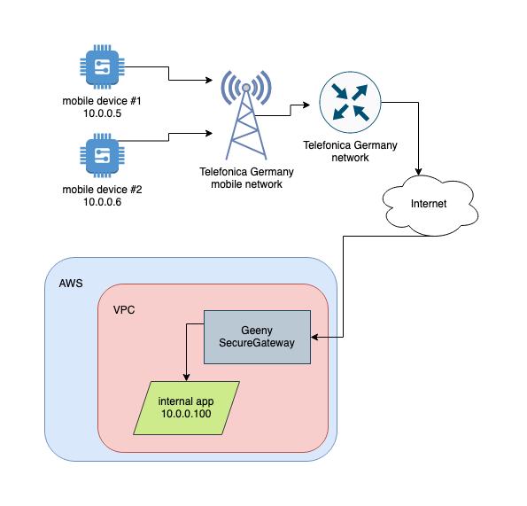

# Geeny SecureGateway Quick Start

## Overview



This AMI will help you configure a wireguard VPN connection to the o2 network.

This VPN connection will provide you with a private method of connecting to your Geeny SecureSIM devices on the o2 network.

## Prerequisites

In order to use the Geeny SecureGateway, the following are required:

- The ability to launch an EC2 instance with an AMI from the AWS Marketplace
- Sims purchased from the Geeny SecureSIM shop: https://shop.geeny.io

## Setup Guide

### Step 1: Ensure you have Geeny SecureSIMs

You need these SIMs for two reasons:

- To test the connectivity with the VPN endpoint
- To ensure access to the Telefonica KITE platform. (These details will be communicated to you via o2.)

### Step 2: Understand and note that o2 will NEVER ask you for your private key

This is very important. At no point will any associate of o2 ever ask you for your private key.

If such a request is made, do not reply, and reach out ot support@geeny.io.

### Step 3: Launch the Geeny SecureGateway configuration utility

Login to the AMI via the `ubuntu` user and the SSH keypair you specified to AWS.

Run the configuration utility:

```
sudo /opt/sg/sg
```


### Step 4: Generate new wireguard VPN keypair / Import existing keypair

Wireguard uses a public and private keypair for all cryptography.

It is ok, even required, to share the public key.

**It is never ok to share the private key.**

#### Generate new wireguard VPN keypair

If you do not have an existing keypair, please select option #1 and a keypair will be generated for you:


#### Import existing keypair

If you have an existing keypair you would like to use, please select option #2 and enter the keypair details.


### Step 5: Registering with o2

You are required to register with o2 in order to complete the VPN setup process.

You must email the address `sg-registration@geeny.io` with the same email address used to purchase the SIM cards.

**NOTE:** o2 will reject registration attempts from email addresses other than what was used to what to purchase the SIM cards.

You must send o2 your public key.

o2 in return will send you:

- your connection's public key
- relevant connectivity details

Option #3 in the configuration utility will display the relevant registration details.

### Step 6: Configuring the wireguard VPN

Option #4 will allow you to enter the details as provided by o2


### Step 7: Activate and display wireguard VPN connection

Option #5 will allow you to activate the connection


Option #6 will allow you to view the connection details.


### Step 8: Test connectivity with a SecureSIM device

You must use, configure, and connect a device with a Geeny SecureSIM.

Once you have done that, you can use option #9 to test connectivity.


### Trouble shooting:

If you are unable to connect to your device, please email support@geeny.io.
