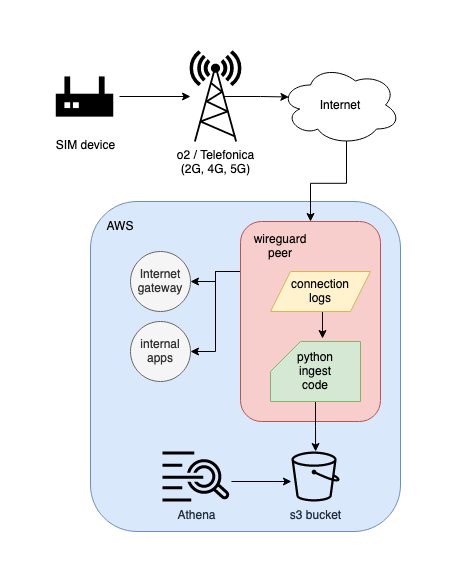

# SecureGateway Connection tracking

Due to the packets of the SIM devices flowing through a Wireguard/IPSec NAT server, it is possible to track and log the connections being made.

This was inspired by AWS VPC flow logs.

Because these connections are NAT'ed, this work must be done on the server, and is not possible for AWS to do within the VPC.

This work is experimental and has not been tested at mass scale. (Thousands and thousands of devices making millions of connections.)
